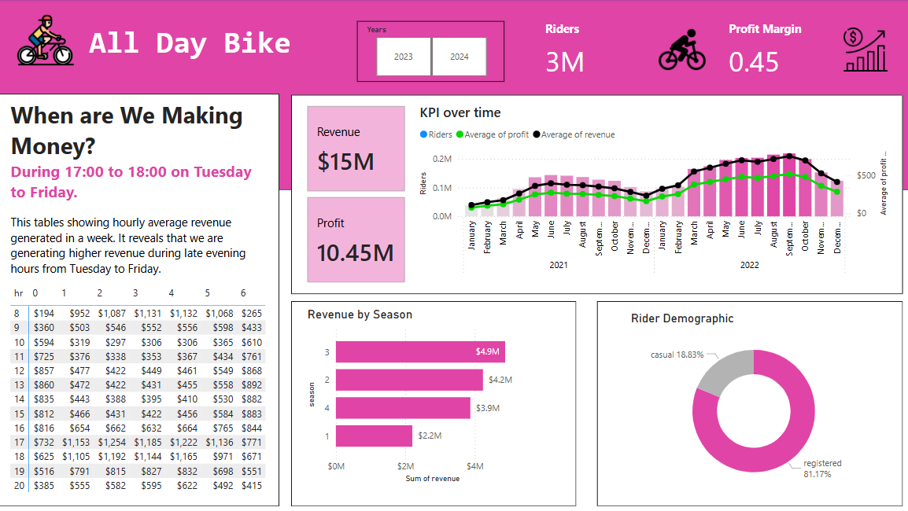
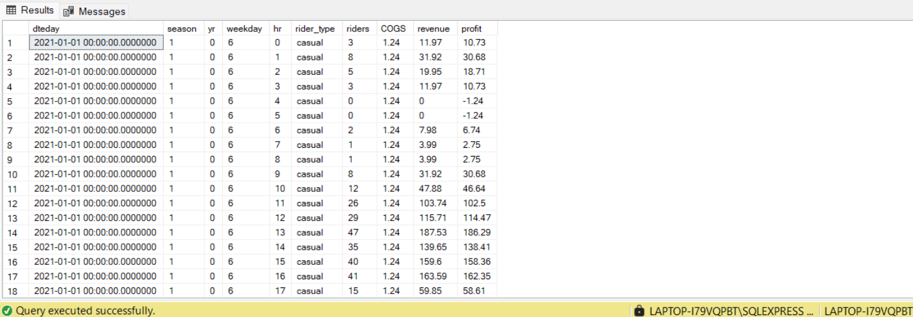

# All Day Bike Dashboard Development 

# Table of Content
- [Objectives](#objectives)
- [User Requirement](#user-requirement)
  - [Use Case](#use-case)
  - [Dashboard Criteria](#dashboard-criteria)
- [Major Project Activities ](#major-project-activities)
- [Deliverables](#deliverables)
- [Working Overview](#working-overview)
   - [Data Preparation and cleaning ](#data-preparation-and-cleaning)
  - [Visualisation in Power BI ](#visualisation-in-power-bi)
  - [Analysis](#analysis)
  - [Final Report](#final-report)

# Objectives
-To develop a dashboard for All Day Bike which showcases key performance metrics to support data-driven decision making.

-To overview the revenue generated hourly.

-To observe the profit and revenue trends.

-To gain valuable insights based on seasonal factor and rider demographics.

-To serve an insight on potential price adjustments for next year based on the data analysis.

# User Requirement 

## Use Cases 
-Hourly Revenue Analysis

-Profit and Revenue Trend

-Seasonal Revenue Insight

-Rider Demographic

-Final Report (recommendation)

## Dashboard Criteria
-Using company colour and theme.

-User-friendly and easy to navigate 

# Major Project Activities 
-Data gathering/searching: Searching for the relevant data.

-Data Cleaning: Remove any irrelevant information, altering the tables.

-Dashboard: Containing the relevant data.

-Final Report: Suggesting recommendations. 

# Deliverables
-Dashboard: Containing the relevant data.

-Final Report: Suggesting recommendations. 

# Working Overview

## Data Preparation and cleaning 

### Dataset required

### Data cleaning in SQL 

Combining table year 0 with year 1

'''sql
select * from bike_share_yr_0
union all
select * from bike_share_yr_1
'''

Combine the cost table to the combined tables above

'''sql
with yr01 as (
select * from bike_share_yr_0
union all
select * from bike_share_yr_1)

select * 
from yr01 a
left join cost_table b
on a.yr = b.yr
'''

Select the relevant information
'''sql
with yr01 as (
select * from bike_share_yr_0
union all
select * from bike_share_yr_1)

select 
dteday,
season,
a.yr,
weekday,
hr,
price,
rider_type,
riders,
COGS
from yr01 a
left join cost_table b
on a.yr = b.yr
'''

create the revenue and profit column using calculation

'''sql
with yr01 as (
select * from bike_share_yr_0
union all
select * from bike_share_yr_1)

select 
dteday,
season,
a.yr,
weekday,
hr,
price,
rider_type,
riders,
COGS, 
riders*price as revenue,
riders*price-COGS*riders as profit
from yr01 a
left join cost_table b
on a.yr = b.yr
'''

The cleaned and preapred dataset would be like this:

## Visualisation in Power BI 

## Analysis 

## Final Report 

