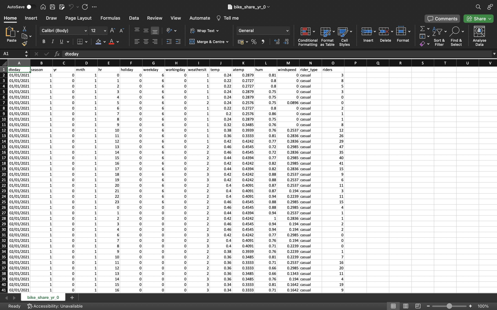
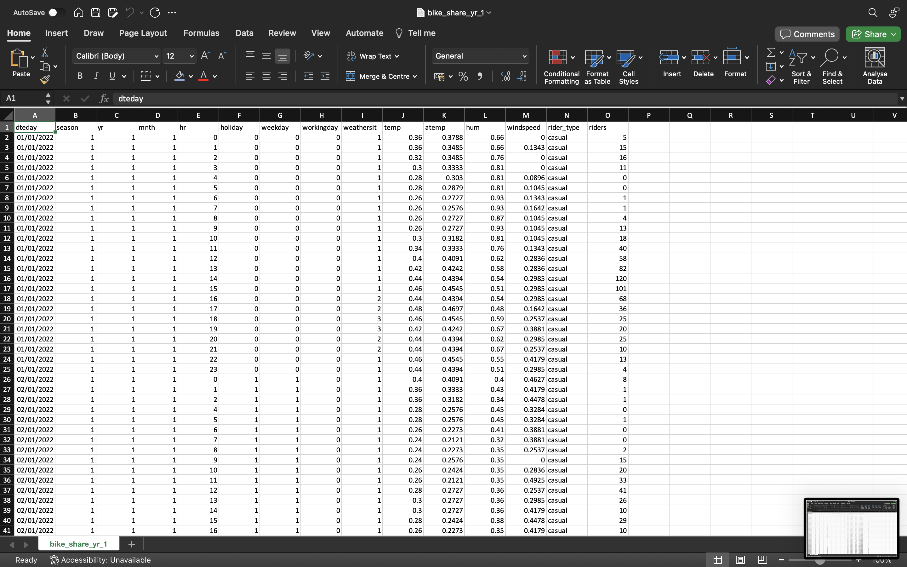
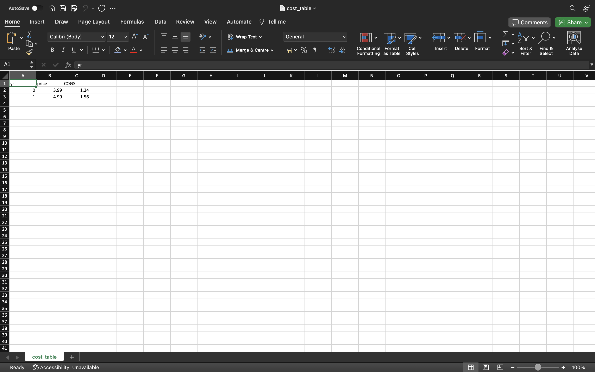
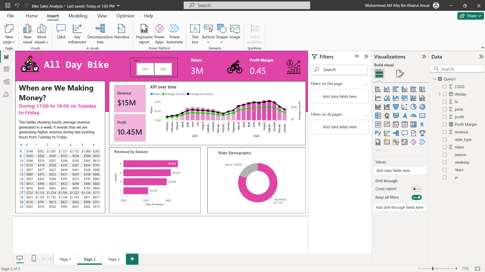
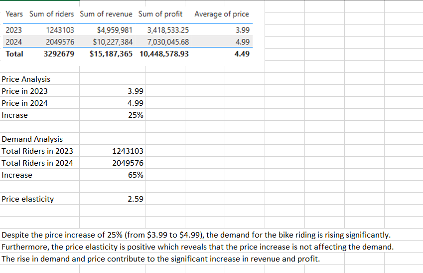

# All Day Bike Dashboard Development 


# Table of Content
- [Objectives](#objectives)
- [User Requirement](#user-requirement)
  - [Use Case](#use-case)
  - [Dashboard Criteria](#dashboard-criteria)
- [Major Project Activities ](#major-project-activities)
- [Deliverables](#deliverables)
- [Working Overview](#working-overview)
   - [Data Preparation and cleaning ](#data-preparation-and-cleaning)
  - [Visualisation in Power BI ](#visualisation-in-power-bi)
  - [Final Report](#final-report)

# Objectives
-To develop a dashboard for All Day Bike which showcases key performance metrics to support data-driven decision making.

-To overview the revenue generated hourly.

-To observe the profit and revenue trends.

-To gain valuable insights based on seasonal factor and rider demographics.

-To serve an insight on potential price adjustments for next year based on the data analysis.

# User Requirement 

## Use Cases 
-Hourly Revenue Analysis

-Profit and Revenue Trend

-Seasonal Revenue Insight

-Rider Demographic

-Final Report (recommendation)

## Dashboard Criteria
-Using company colour and theme.

-User-friendly and easy to navigate 

# Major Project Activities 
-Data gathering/searching: Searching for the relevant data.

-Data Cleaning: Remove any irrelevant information, altering the tables.

-Dashboard: Containing the relevant data.

-Final Report: Suggesting recommendations. 

# Deliverables
-Dashboard: Containing the relevant data.

-Final Report: Suggesting recommendations. 


# Working Overview

## Data Preparation and cleaning 

### Dataset required
 dataset of year 0
 

 dataset of year 1
 

 dataset of table cost
 

### Data cleaning in SQL 

Combining table year 0 with year 1

```sql
select * from bike_share_yr_0
union all
select * from bike_share_yr_1
```

Combine the cost table to the combined tables above

```sql
with yr01 as (
select * from bike_share_yr_0
union all
select * from bike_share_yr_1)

select * 
from yr01 a
left join cost_table b
on a.yr = b.yr
```

Select the relevant information
```sql
with yr01 as (
select * from bike_share_yr_0
union all
select * from bike_share_yr_1)


select 
dteday,
season,
a.yr,
weekday,
hr,
price,
rider_type,
riders,
COGS
from yr01 a
left join cost_table b
on a.yr = b.yr
```

create the revenue and profit column using calculation

```sql
with yr01 as (
select * from bike_share_yr_0
union all
select * from bike_share_yr_1)


select 
dteday,
season,
a.yr,
weekday,
hr,
price,
rider_type,
riders,
COGS, 
riders*price as revenue,
riders*price-COGS*riders as profit
from yr01 a
left join cost_table b
on a.yr = b.yr
```

The cleaned and preapred dataset would be like this:


## Visualisation in Power BI 
Insert the required information into the table, chart and metrics.



## Final Report 


### Potential Price Adjustment	
Since the past price increase of 25% did not reduce the demand, we would suggest to increase the price no higher than 25% as previously. 	
The suggested price increse is around 10% results in the new price to be %5.49.	
Given there will be increase in demand (or even maintain), the potential revenue and profit will be higher than before.	
There are many actions need to be taken before implementing new price.	
	
### Recommendations	
1. Conducting more market research: analyse various factors, including customer satisfaction levels, competitor pricing adjustments, and overall economic conditions. This research will provide valuable insights into whether it is more prudent to lean towards a lower or higher percentage increase.	
2. Close monitor customer response and sales data: analysing real-time customer feedback and sales trends, adjustments can be made as necessary. If demand shows signs of weakening, a recalibration may be required to prevent revenue loss.	


